<!-- markdown-toc start - Don't edit this section. Run M-x markdown-toc-refresh-toc -->
**Table of Contents**

- [Benchmarks Results](#benchmarks-results)
    - [Test Methods](#test-methods)
        - [Running tests](#running-tests)
        - [Generating results](#generating-results)
        - [Benchmarks framework](#benchmarks-framework)
        - [Profiles](#profiles)
    - [Results](#results)
        - [get](#get)
            - [Details](#details)
            - [Results](#results-1)
        - [assoc](#assoc)
            - [Details](#details-1)
            - [Results](#results-2)
            - [By keys](#by-keys)
            - [By width](#by-width)
        - [merge](#merge)
            - [Details](#details-2)
                - [Fast map merge](#fast-map-merge)
                - [Inline Merge](#inline-merge)
            - [Results](#results-3)
                - [Fast Map merge](#fast-map-merge)
                - [Inline merge & fast merge](#inline-merge--fast-merge)
            - [By width](#by-width-1)
            - [By keys](#by-keys-1)
        - [get-in](#get-in)
            - [Test details](#test-details)
            - [Results](#results-4)
            - [By keys](#by-keys-2)
            - [By width](#by-width-2)
        - [memoize](#memoize)
            - [Test details](#test-details-1)
            - [Results](#results-5)
            - [By number of arguments](#by-number-of-arguments)
            - [By type of arguments](#by-type-of-arguments)
        - [assoc-in](#assoc-in)
            - [Test details](#test-details-2)
            - [Results](#results-6)
            - [By keys](#by-keys-3)
            - [By width](#by-width-3)
        - [update-in](#update-in)
            - [By keys](#by-keys-4)
            - [By width](#by-width-4)
        - [select-keys](#select-keys)
            - [Test details](#test-details-3)
            - [Results](#results-7)
            - [By keys](#by-keys-5)
            - [By width](#by-width-5)

<!-- markdown-toc end -->
# Benchmarks Results

## Test Methods

### Running tests

```bash
lein with-profile +direct,+bench,+cli,+test-build do clean, uberjar
java -Xmx8G -Xms8G \
     -XX:+UseG1GC \
     -jar target/uberjar/clj-fast-0.0.9-SNAPSHOT.jar \
     --max-width 4 \
     --max-depth 4 \
     --quick false \
     --types "keyword?" \
     --name new \
     assoc assoc-in assoc-rec get get-in get-rec memoize merge select-keys update-in
```

### Generating results

Load `analysis.clj` and:

```clojure
(ns clj-fast.analysis)
(def raw-data
  (-> "./benchmarks/all-clj-fast-bench.edn"
      load-results
      (update :get-rec #(map (fn [m] (assoc m :width 0)) %))
      (update :merge #(remove (comp #{1} :keys) %))))

(def all-charts
  (conj
   (common-charts raw-data)
   (chart-get :get raw-data)
   (chart-get :get-rec raw-data)
   (chart-assoc-rec raw-data)))

(logify :merge all-charts)

(write-charts all-charts)
```

### Benchmarks framework

[Criterium](https://github.com/hugoduncan/criterium) is used to run quick benchmarks.

### Profiles

Benchmarks were run with 8GB heap and G1 garbage collection.

## Results

### get

#### Details

`get` was tested on `map`, `record` and `fast-map`, `fast-get` was tested on `fast-map`.

Moreover, different get methods were tested:
- map on keyword.
- keyword on map.
- keyword on record.
- `.get` from record.
- `.field` from record.

#### Results

- `get` from record ~50% slower than from map.
- `fast-get` from `fast-map` ~ 2x faster than `get`ting from regular
  map, with gains increasing as the map becomes larger. (Metosin)
- invoking a map, calling a keyword on a map, accessing `valAt` all have
  approximately the same performance, however, there are more levels of
  indirection when calling a keyword, less than when invoking a map, and
  zero when calling `valAt`.
- All other methods besides `get` are faster 
- The fastest way to get a field from a record is a field accessor.

| get from map                     | get from record                      |
| :---:                            | :---:                                |
| 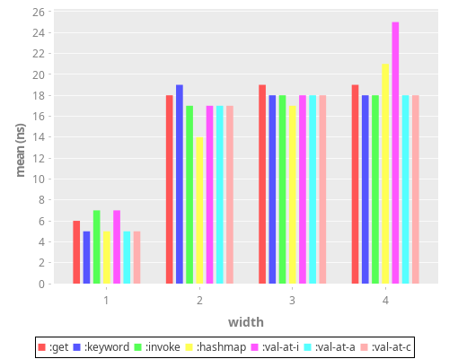 |  |

### assoc

#### Details

Assoc and fast assoc performance are tested with maps and records.

#### Results

- `assoc` to record is as fast as `assoc`ing to map.
- `fast-assoc` ~ 5.7% faster than `assoc`. (Metosin)

#### By keys

| 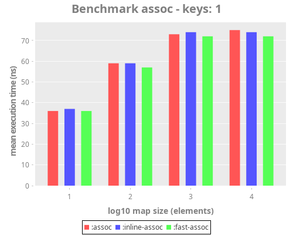 | 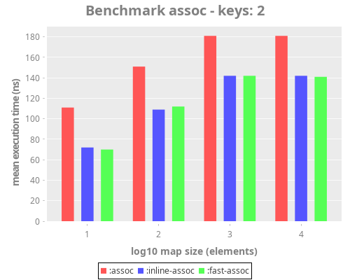 |
| :---:                              | :---:                              |
| 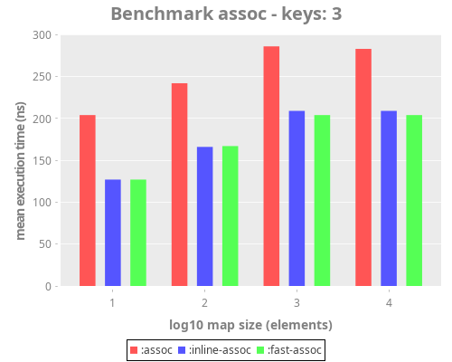 | 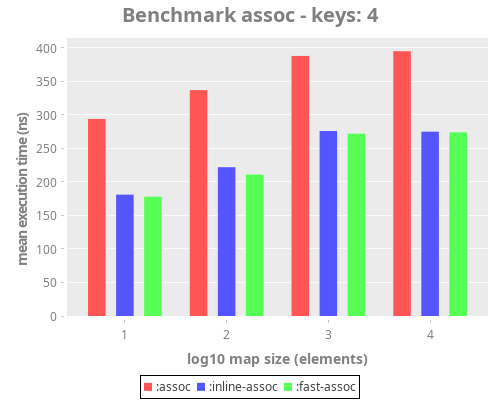 |

#### By width

|  | 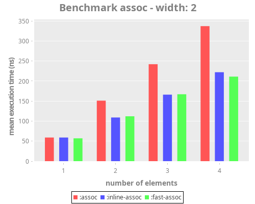 |
| :---:                              | :---:                              |
| 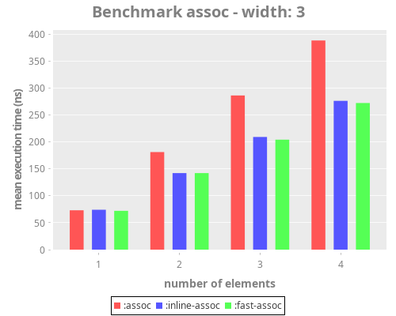 | 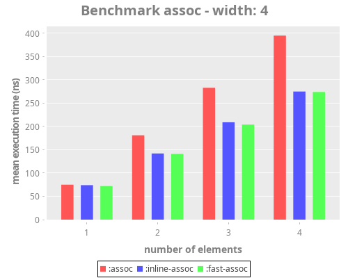 |

### merge

#### Details

##### Fast map merge

fast map merge was implemented by Metosin and uses `kv-reduce` to assoc
one map into another.
Compare to regular merge for the keys=2 case.

##### Inline Merge

Several inline implementations were compared:
- `inline-merge`: uses `conj` directly on all input maps instead of reducing.
- `inline-fast-map-merge`: inline merges maps using Metosin's `fast-map-merge`.
- `inline-tmerge`: Uses transients to merge the maps. Basic implementation by Joinr.

#### Results

##### Fast Map merge

fast-map-merge is faster than regular merge, especially for smaller
maps, with diminishing returns as maps get bigger.

##### Inline merge & fast merge

Sees diminishing returns on the benefit of merging more maps, but some
speedup is measurable. tmerge is slower for small maps but for larger
maps is faster than regular merge. The speedup by fast-map-merge is
about 15-25%, width diminishing returns the bigger maps get.


Execution time is presented in logarithmic scale due to the huge differences for different map sizes.

#### By width

|  | 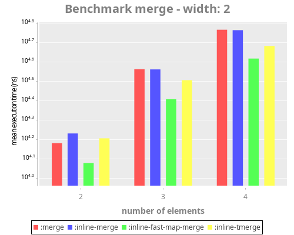 |
| :---:                              | :---:                              |
|  |  |

#### By keys

|                                    | 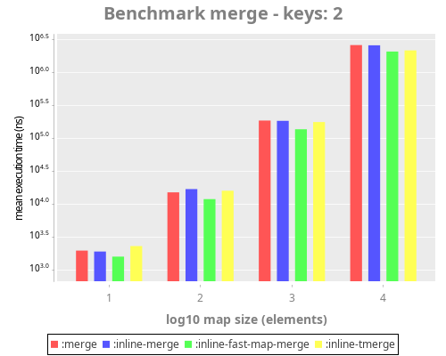 |
| :---:                              | :---:                              |
|  |  |

### get-in

#### Test details

`get-in` was tested against an inlined implementation.

#### Results

Inline implementation faster by a factor of 4-5.

#### By keys

|  | 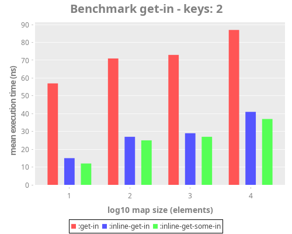 |
| :---:                               | :---:                               |
| 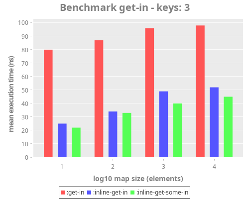 | 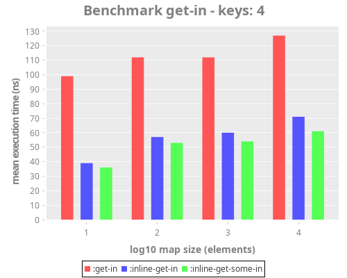 |

#### By width

| 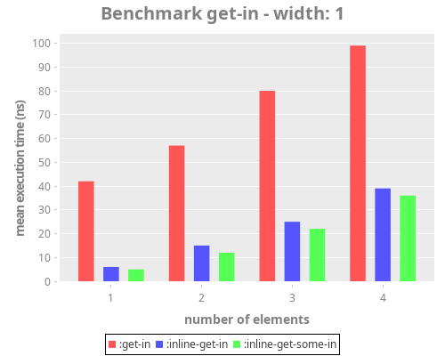 | 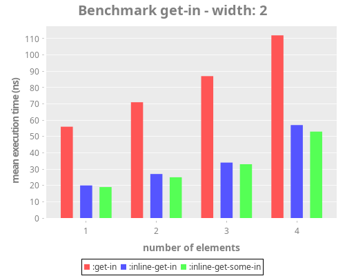 |
| :---:                               | :---:                               |
|  | 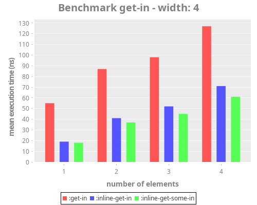 |

### memoize

Closely related to get-in

#### Test details

memoize was tested against an inlining implementation using a clojure atom
(`memoize-n`) and one using a concurrent-hash-map (`memoize-c`)

#### Results

Different implementation are faster depending on the type of the memoized
arguments:
- `memoize`: core.memoize, always slower
- `memoize-n` is better when all arguments are keywords.
- `memoize-c` is better for any other case.
- `hm-memoize` is faster than `memoize` but slower than `memoize-c`.
- `cm-memoize` is faster than `memoize` but slower than `memoize-c`.

#### By number of arguments

| 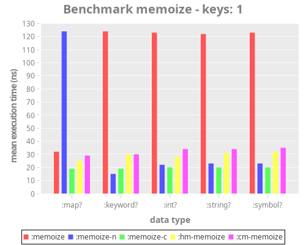 | 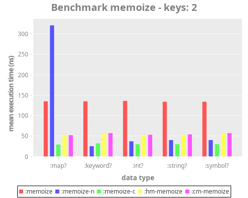 |
| :---:                               | :---:                               |
| 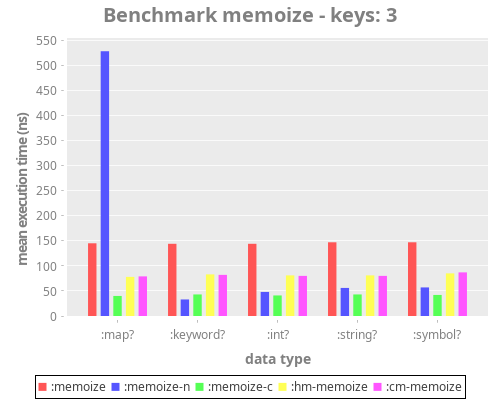 | 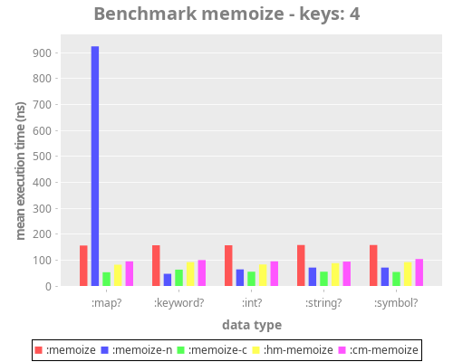 |

#### By type of arguments

| 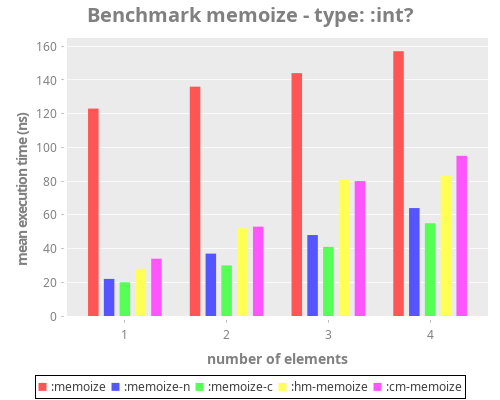    | 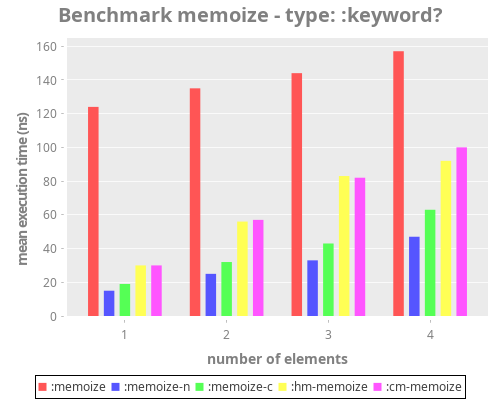 |
| :---:                                      | :---:                                       |
| 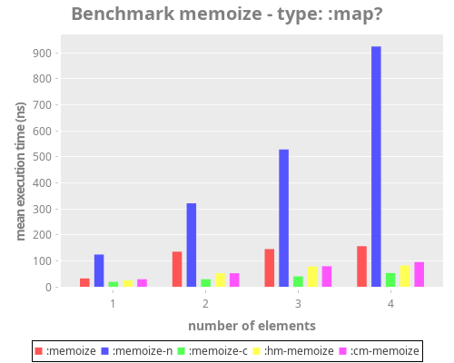    |   |
|                                            |                                             |
|  |                                             |

### assoc-in

#### Test details

Assoc-in is tested vs. an inlined implementation with vanilla maps, gets and 
assoc, all core functions.

#### Results

- the inlined implementation is always faster and exhibits compounding returns 
for deeper maps, about ~25ns/key.

#### By keys

| 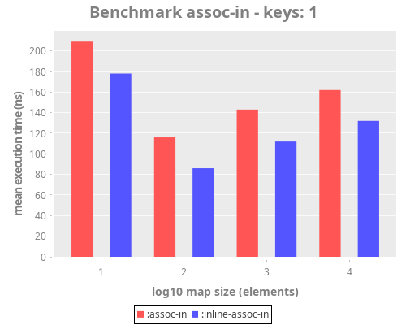 |  |
| :---:                                 | :---:                                 |
|  | 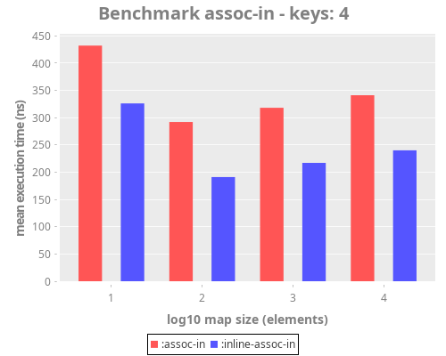 |

#### By width

| 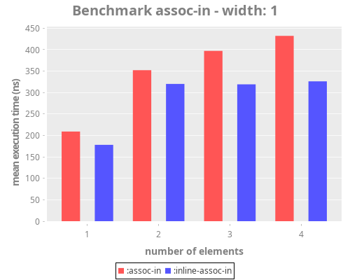 | 
| :---:                              | :---:                              |
| 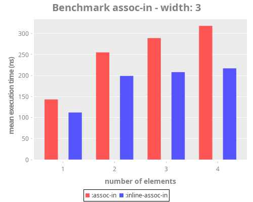 | 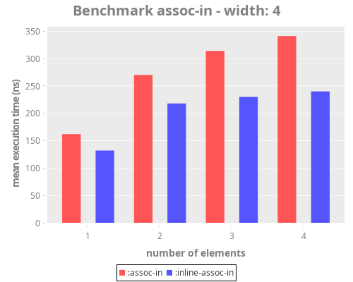


### update-in

#### By keys

|  | 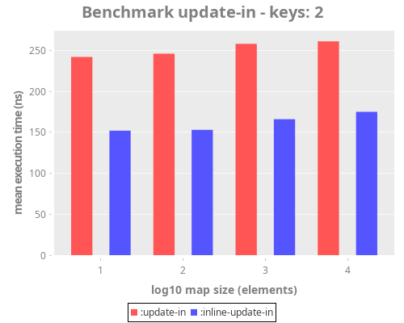
| :---:                              | :---:                              |
|  | 

#### By width

| 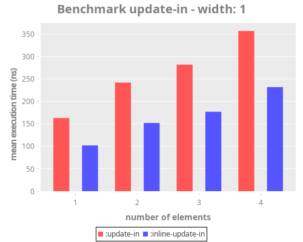 | 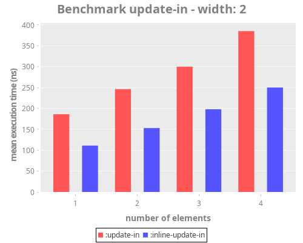
| :---:                              | :---:                              |
| 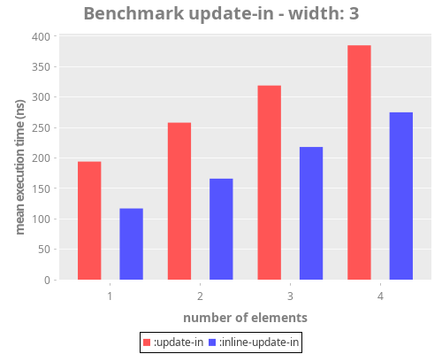 | 

### select-keys

#### Test details

`select-keys` was tested against two inlined implementations:
- correct and slower implementation.
- quicker and dirty implementation.

#### Results

Inline implementation faster by a factor of 10 or more, depends
on the number of selected keys.

#### By keys

|  | 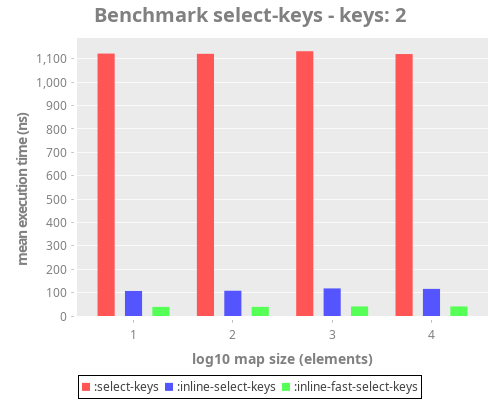
| :---:                              | :---:                              |
| 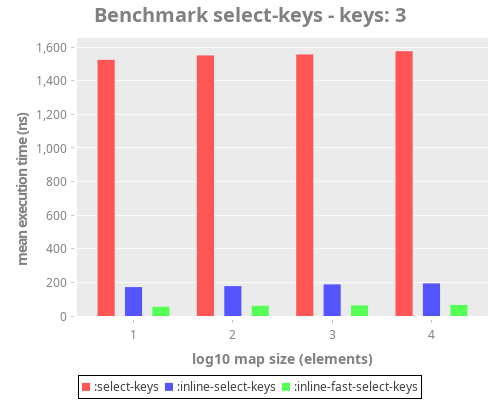 | 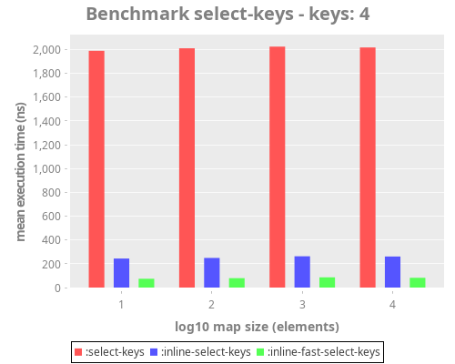

#### By width

|  | 
| :---:                              | :---:                              |
|  | 
