<!-- markdown-toc start - Don't edit this section. Run M-x markdown-toc-refresh-toc -->
**Table of Contents**

- [Benchmarks Results](#benchmarks-results)
    - [Test Methods](#test-methods)
        - [Running tests](#running-tests)
        - [Benchmarks framework](#benchmarks-framework)
        - [Profiles](#profiles)
    - [Tests details](#tests-details)
        - [assoc](#assoc)
        - [assoc-in](#assoc-in)
        - [get](#get)
        - [merge](#merge)
            - [Fast map merge](#fast-map-merge)
            - [Inline Merge](#inline-merge)
        - [get-in](#get-in)
        - [select-keys](#select-keys)
    - [Results Summary](#results-summary)
        - [assoc](#assoc-1)
        - [Assoc-in](#assoc-in)
        - [get](#get-1)
        - [merge](#merge-1)
            - [Fast Map merge](#fast-map-merge)
            - [Inline merge & fast merge](#inline-merge--fast-merge)
        - [get-in](#get-in-1)
        - [select-keys](#select-keys-1)
    - [Detailed Results](#detailed-results)
        - [get](#get-2)
        - [assoc](#assoc-2)
            - [By keys](#by-keys)
            - [By width](#by-width)
        - [merge](#merge-2)
            - [By keys](#by-keys-1)
            - [By width](#by-width-1)
        - [get-in](#get-in-2)
            - [By keys](#by-keys-2)
            - [By width](#by-width-2)
        - [assoc-in](#assoc-in-1)
            - [By keys](#by-keys-3)
            - [By width](#by-width-3)
        - [update-in](#update-in)
            - [By keys](#by-keys-4)
            - [By width](#by-width-4)
        - [select-keys](#select-keys-2)
            - [By keys](#by-keys-5)
            - [By width](#by-width-5)

<!-- markdown-toc end -->
# Benchmarks Results

## Test Methods

### Running tests

```bash
lein with-profile bench,small-heap,parallel run
```

### Benchmarks framework

[Criterium](https://github.com/hugoduncan/criterium) is used to run quick benchmarks.

### Profiles

Benchmarks are run on all combinations of the following:

- heap size: big (9G), medium (5G), small (2G).
- Garbage collection: parallel, G1

## Tests details

### assoc

Assoc and fast assoc performance are tested with maps and records.

### assoc-in

Assoc-in is tested vs. an inlined implementation with vanilla maps, gets and 
assoc, all core functions.

### get

`get` was tested on `map`, `record` and `fast-map`, `fast-get` was tested on `fast-map`.

Moreover, different get methods were tested:
- map on keyword.
- keyword on map.
- keyword on record.
- `.get` from record.
- `.field` from record.

### merge

#### Fast map merge

fast map merge was implemented by Metosin and uses `kv-reduce` to assoc
one map into another.
Was compared vs. regular merge.

#### Inline Merge

Two different implementations of inlining merge were tested, one based on the core implementation of merge, and one on Metosin's.

### get-in

`get-in` was tested against an inlined implementation.

### select-keys

`select-keys` was tested against an inlined implementation.

## Results Summary

### assoc

NOTE: the first result is surprising as it does not correlate with benchmarks
run in the REPL. Requires further study.

- `assoc` to record ~twice as fast as `assoc`ing to map.
- `fast-assoc` ~ 5.7% faster than `assoc`. (Metosin)

### Assoc-in

- the inlined implementation is always faster and exhibits compounding returns 
for deeper maps.

### get

NOTE: Same case as the assoc experiment, with benchmarks results being the opposite of what's measured in a running REPL.

- `get` from record ~50% slower than from map.
- `fast-get` from `fast-map` ~ 8.4% faster than `get`ting from regular map. (Metosin)
- map on keyword > keyword on map > get from map (ordered by speed)
- field from record > keyword on record > .get from record > get from record.

### merge

#### Fast Map merge

Distinctly faster than regular merge, by about 30%, but differences might depend on map sizes, so more benchmarks are required.

#### Inline merge & fast merge

Sees diminishing returns on the benefit of merging more maps, but the speedup
is measurable.

### get-in

Inline implementation faster by a factor of 4-5.

### select-keys

Inline implementation faster by a factor of 10 or more, depends
on the number of selected keys.

## Detailed Results

### get


### assoc

#### By keys

|  |  |
| :---:                              | :---:                              |
|  |  |

#### By width

| 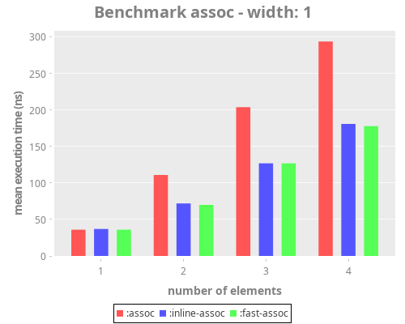 |  |
| :---:                              | :---:                              |
|  |  |

### merge

Execution time is presented in logarithmic scale due to the huge differences for different map sizes.

#### By keys

|                                    |  |
| :---:                              | :---:                              |
|  | 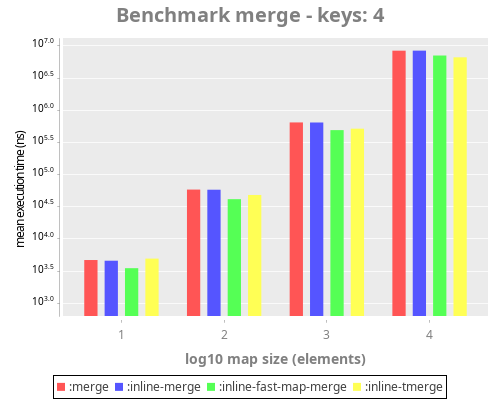 |

#### By width

| 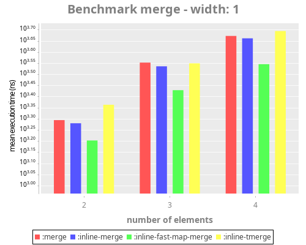 |  |
| :---:                              | :---:                              |
| 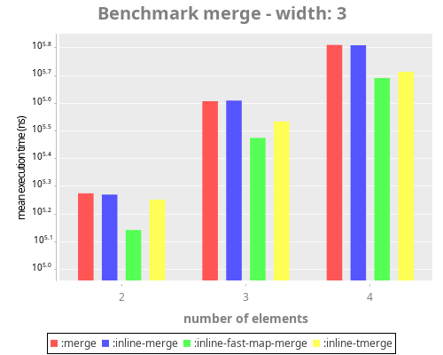 | 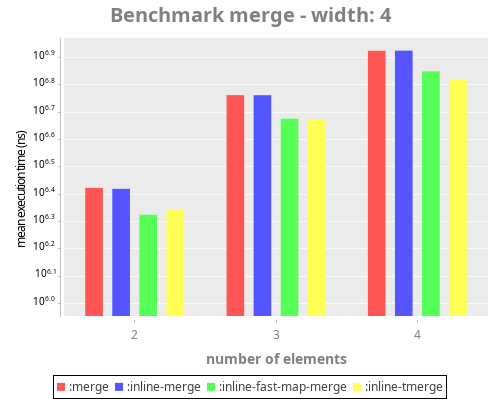 |

### get-in

#### By keys

|  |  |
| :---:                               | :---:                               |
|  |  |

#### By width

|  |  |
| :---:                               | :---:                               |
| 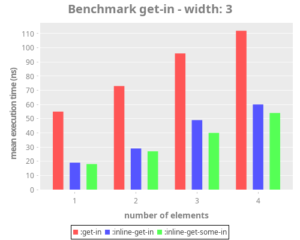 |  |

### assoc-in

#### By keys

|  | 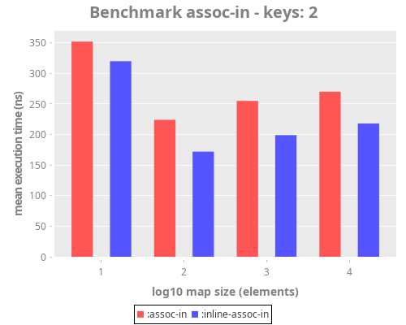 |
| :---:                                 | :---:                                 |
|  |  |

#### By width

|  | 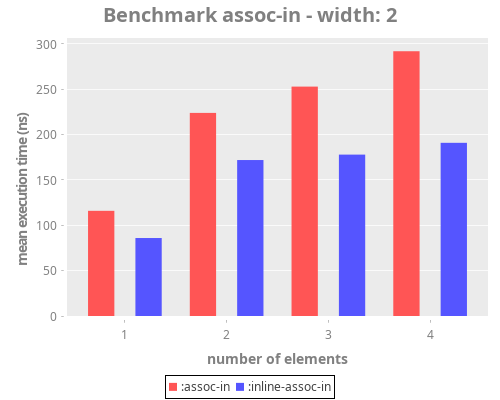
| :---:                              | :---:                              |
|  | 


### update-in

#### By keys

| 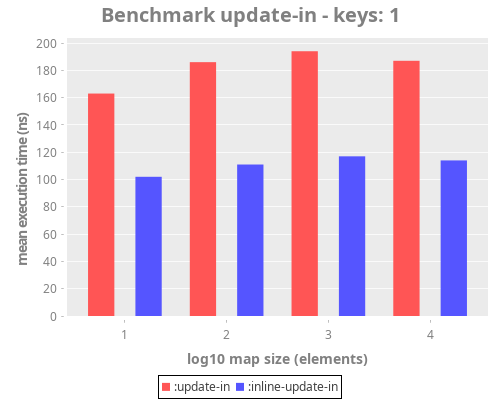 | 
| :---:                              | :---:                              |
|  | 

#### By width

|  | 
| :---:                              | :---:                              |
|  | 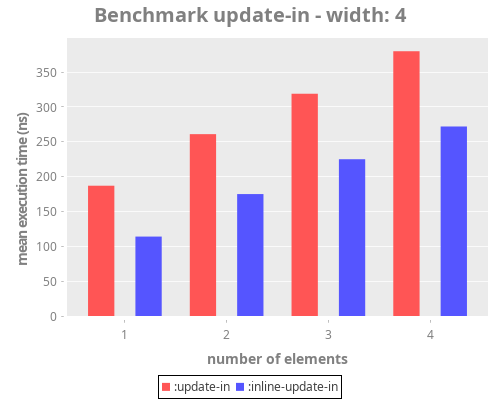

### select-keys

#### By keys

| 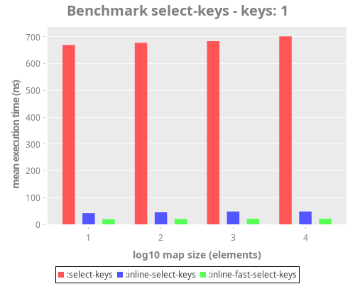 | 
| :---:                              | :---:                              |
|  | 

#### By width

|  | 
| :---:                              | :---:                              |
|  | 

| heap  | gc       | test                     | execution time mean |
|-------|----------|--------------------------|---------------------|
| big   | g1       | assoc to map             | 60.603761 ns        |
| big   | g1       | assoc to record          | 38.332317 ns        |
| big   | g1       | fast-assoc to map        | 58.735587 ns        |
| big   | g1       | fast-assoc to record     | 39.049585 ns        |
| big   | g1       | assoc-in 1               | 59.427094 ns        |
| big   | g1       | assoc-in 2               | 87.421121 ns        |
| big   | g1       | assoc-in 3               | 184.219410 ns       |
| big   | g1       | assoc-in 4               | 211.092112 ns       |
| big   | g1       | inline-assoc-in 1        | 39.376813 ns        |
| big   | g1       | inline-assoc-in 2        | 125.912361 ns       |
| big   | g1       | inline-assoc-in 3        | 139.318034 ns       |
| big   | g1       | inline-assoc-in 4        | 148.861730 ns       |
| big   | g1       | update-in 1              | 152.947998 ns       |
| big   | g1       | inline-update-in 1       | 147.596307 ns       |
| big   | g1       | update-in 2              | 212.675980 ns       |
| big   | g1       | inline-update-in 2       | 163.617075 ns       |
| big   | g1       | update-in 3              | 255.303195 ns       |
| big   | g1       | inline-update-in 3       | 191.001550 ns       |
| big   | g1       | update-in 4              | 294.511887 ns       |
| big   | g1       | inline-update-in 4       | 217.878713 ns       |
| big   | g1       | get from map             | 11.339306 ns        |
| big   | g1       | map on keyword           | 8.574417 ns         |
| big   | g1       | keyword on map           | 10.460608 ns        |
| big   | g1       | get from record          | 14.457372 ns        |
| big   | g1       | keyword on record        | 5.998421 ns         |
| big   | g1       | .get from record         | 12.510472 ns        |
| big   | g1       | get field from record    | 3.684584 ns         |
| big   | g1       | get from fast-map        | 38.197091 ns        |
| big   | g1       | fast-get from fast-map   | 7.799408 ns         |
| big   | g1       | merge maps               | 457.884247 ns       |
| big   | g1       | fast merge maps          | 341.036887 ns       |
| big   | g1       | merge 2 maps             | 506.583409 ns       |
| big   | g1       | inline merge 2 maps      | 420.007590 ns       |
| big   | g1       | inline fast merge 2 maps | 344.121518 ns       |
| big   | g1       | merge 3 maps             | 1.664652 µs         |
| big   | g1       | inline merge 3 maps      | 1.490882 µs         |
| big   | g1       | inline fast merge 3 maps | 1.443558 µs         |
| big   | g1       | merge 4 maps             | 1.954119 µs         |
| big   | g1       | inline merge 4 maps      | 1.797741 µs         |
| big   | g1       | inline fast merge 4 maps | 1.774046 µs         |
| big   | g1       | get-in 1                 | 39.786330 ns        |
| big   | g1       | fast get-in 1            | 10.344779 ns        |
| big   | g1       | get some in 1            | 5.947930 ns         |
| big   | g1       | get-in 2                 | 57.110968 ns        |
| big   | g1       | fast get-in 2            | 18.057849 ns        |
| big   | g1       | get some in 2            | 10.442508 ns        |
| big   | g1       | get-in 3                 | 73.667482 ns        |
| big   | g1       | fast get-in 3            | 25.383331 ns        |
| big   | g1       | get some in 3            | 13.199312 ns        |
| big   | g1       | get-in 4                 | 86.140015 ns        |
| big   | g1       | fast get-in 4            | 33.072601 ns        |
| big   | g1       | get some in 4            | 17.824613 ns        |
| big   | g1       | select 1/4 keys          | 192.296473 ns       |
| big   | g1       | fast select 1/4 keys     | 24.456551 ns        |
| big   | g1       | select 2/4 keys          | 276.708812 ns       |
| big   | g1       | fast select 2/4 keys     | 32.690009 ns        |
| big   | g1       | select 3/4 keys          | 366.079642 ns       |
| big   | g1       | fast select 3/4 keys     | 44.340308 ns        |
| big   | g1       | select 4/4 keys          | 463.241990 ns       |
| big   | g1       | fast select 4/4 keys     | 56.175028 ns        |
| big   | parallel | assoc to map             | 32.371441 ns        |
| big   | parallel | assoc to record          | 19.345769 ns        |
| big   | parallel | fast-assoc to map        | 30.053994 ns        |
| big   | parallel | fast-assoc to record     | 16.126589 ns        |
| big   | parallel | assoc-in 1               | 49.492236 ns        |
| big   | parallel | assoc-in 2               | 69.415102 ns        |
| big   | parallel | assoc-in 3               | 167.128542 ns       |
| big   | parallel | assoc-in 4               | 189.282406 ns       |
| big   | parallel | inline-assoc-in 1        | 27.377661 ns        |
| big   | parallel | inline-assoc-in 2        | 106.761482 ns       |
| big   | parallel | inline-assoc-in 3        | 112.802275 ns       |
| big   | parallel | inline-assoc-in 4        | 121.005657 ns       |
| big   | parallel | update-in 1              | 134.903868 ns       |
| big   | parallel | inline-update-in 1       | 135.611914 ns       |
| big   | parallel | update-in 2              | 193.789099 ns       |
| big   | parallel | inline-update-in 2       | 154.667823 ns       |
| big   | parallel | update-in 3              | 235.722744 ns       |
| big   | parallel | inline-update-in 3       | 184.080886 ns       |
| big   | parallel | update-in 4              | 280.051438 ns       |
| big   | parallel | inline-update-in 4       | 214.153675 ns       |
| big   | parallel | get from map             | 10.338142 ns        |
| big   | parallel | map on keyword           | 8.876696 ns         |
| big   | parallel | keyword on map           | 9.502878 ns         |
| big   | parallel | get from record          | 14.311665 ns        |
| big   | parallel | keyword on record        | 6.190041 ns         |
| big   | parallel | .get from record         | 11.535257 ns        |
| big   | parallel | get field from record    | 3.636666 ns         |
| big   | parallel | get from fast-map        | 34.894720 ns        |
| big   | parallel | fast-get from fast-map   | 7.051884 ns         |
| big   | parallel | merge maps               | 333.429777 ns       |
| big   | parallel | fast merge maps          | 226.055813 ns       |
| big   | parallel | merge 2 maps             | 362.941200 ns       |
| big   | parallel | inline merge 2 maps      | 281.370760 ns       |
| big   | parallel | inline fast merge 2 maps | 227.559517 ns       |
| big   | parallel | merge 3 maps             | 1.176878 µs         |
| big   | parallel | inline merge 3 maps      | 1.049544 µs         |
| big   | parallel | inline fast merge 3 maps | 997.989050 ns       |
| big   | parallel | merge 4 maps             | 1.476614 µs         |
| big   | parallel | inline merge 4 maps      | 1.280925 µs         |
| big   | parallel | inline fast merge 4 maps | 1.256592 µs         |
| big   | parallel | get-in 1                 | 39.999427 ns        |
| big   | parallel | fast get-in 1            | 10.316292 ns        |
| big   | parallel | get some in 1            | 5.910026 ns         |
| big   | parallel | get-in 2                 | 51.284549 ns        |
| big   | parallel | fast get-in 2            | 17.784598 ns        |
| big   | parallel | get some in 2            | 10.200495 ns        |
| big   | parallel | get-in 3                 | 68.618918 ns        |
| big   | parallel | fast get-in 3            | 25.367662 ns        |
| big   | parallel | get some in 3            | 13.067672 ns        |
| big   | parallel | get-in 4                 | 82.598429 ns        |
| big   | parallel | fast get-in 4            | 19.698458 ns        |
| big   | parallel | get some in 4            | 17.315701 ns        |
| big   | parallel | select 1/4 keys          | 172.930122 ns       |
| big   | parallel | fast select 1/4 keys     | 11.368870 ns        |
| big   | parallel | select 2/4 keys          | 213.377422 ns       |
| big   | parallel | fast select 2/4 keys     | 16.799935 ns        |
| big   | parallel | select 3/4 keys          | 274.118673 ns       |
| big   | parallel | fast select 3/4 keys     | 24.881389 ns        |
| big   | parallel | select 4/4 keys          | 312.094822 ns       |
| big   | parallel | fast select 4/4 keys     | 34.382155 ns        |
| med   | g1       | assoc to map             | 48.017200 ns        |
| med   | g1       | assoc to record          | 20.643270 ns        |
| med   | g1       | fast-assoc to map        | 46.291795 ns        |
| med   | g1       | fast-assoc to record     | 25.650662 ns        |
| med   | g1       | assoc-in 1               | 43.117304 ns        |
| med   | g1       | assoc-in 2               | 67.682634 ns        |
| med   | g1       | assoc-in 3               | 172.921140 ns       |
| med   | g1       | assoc-in 4               | 198.950834 ns       |
| med   | g1       | inline-assoc-in 1        | 22.610115 ns        |
| med   | g1       | inline-assoc-in 2        | 31.903842 ns        |
| med   | g1       | inline-assoc-in 3        | 42.472088 ns        |
| med   | g1       | inline-assoc-in 4        | 50.987722 ns        |
| med   | g1       | update-in 1              | 140.507125 ns       |
| med   | g1       | inline-update-in 1       | 139.058500 ns       |
| med   | g1       | update-in 2              | 203.525480 ns       |
| med   | g1       | inline-update-in 2       | 153.105318 ns       |
| med   | g1       | update-in 3              | 240.717953 ns       |
| med   | g1       | inline-update-in 3       | 174.664928 ns       |
| med   | g1       | update-in 4              | 276.727790 ns       |
| med   | g1       | inline-update-in 4       | 199.965659 ns       |
| med   | g1       | get from map             | 8.834362 ns         |
| med   | g1       | map on keyword           | 5.912481 ns         |
| med   | g1       | keyword on map           | 7.808933 ns         |
| med   | g1       | get from record          | 11.003575 ns        |
| med   | g1       | keyword on record        | 3.749699 ns         |
| med   | g1       | .get from record         | 8.644511 ns         |
| med   | g1       | get field from record    | 2.704952 ns         |
| med   | g1       | get from fast-map        | 35.390073 ns        |
| med   | g1       | fast-get from fast-map   | 6.566297 ns         |
| med   | g1       | merge maps               | 447.927732 ns       |
| med   | g1       | fast merge maps          | 324.039570 ns       |
| med   | g1       | merge 2 maps             | 487.202800 ns       |
| med   | g1       | inline merge 2 maps      | 408.914161 ns       |
| med   | g1       | inline fast merge 2 maps | 322.729569 ns       |
| med   | g1       | merge 3 maps             | 1.667746 µs         |
| med   | g1       | inline merge 3 maps      | 1.512118 µs         |
| med   | g1       | inline fast merge 3 maps | 1.436334 µs         |
| med   | g1       | merge 4 maps             | 1.993162 µs         |
| med   | g1       | inline merge 4 maps      | 1.815098 µs         |
| med   | g1       | inline fast merge 4 maps | 1.804004 µs         |
| med   | g1       | get-in 1                 | 34.169670 ns        |
| med   | g1       | fast get-in 1            | 5.289748 ns         |
| med   | g1       | get some in 1            | 4.243272 ns         |
| med   | g1       | get-in 2                 | 48.283999 ns        |
| med   | g1       | fast get-in 2            | 8.627374 ns         |
| med   | g1       | get some in 2            | 7.429364 ns         |
| med   | g1       | get-in 3                 | 66.763657 ns        |
| med   | g1       | fast get-in 3            | 11.984588 ns        |
| med   | g1       | get some in 3            | 9.202201 ns         |
| med   | g1       | get-in 4                 | 79.162261 ns        |
| med   | g1       | fast get-in 4            | 14.872275 ns        |
| med   | g1       | get some in 4            | 11.299371 ns        |
| med   | g1       | select 1/4 keys          | 176.967376 ns       |
| med   | g1       | fast select 1/4 keys     | 11.581138 ns        |
| med   | g1       | select 2/4 keys          | 255.269173 ns       |
| med   | g1       | fast select 2/4 keys     | 17.749808 ns        |
| med   | g1       | select 3/4 keys          | 332.351710 ns       |
| med   | g1       | fast select 3/4 keys     | 27.370380 ns        |
| med   | g1       | select 4/4 keys          | 409.945355 ns       |
| med   | g1       | fast select 4/4 keys     | 35.948932 ns        |
| med   | parallel | assoc to map             | 32.652118 ns        |
| med   | parallel | assoc to record          | 20.071973 ns        |
| med   | parallel | fast-assoc to map        | 30.042532 ns        |
| med   | parallel | fast-assoc to record     | 15.483539 ns        |
| med   | parallel | assoc-in 1               | 49.995857 ns        |
| med   | parallel | assoc-in 2               | 71.163329 ns        |
| med   | parallel | assoc-in 3               | 163.669857 ns       |
| med   | parallel | assoc-in 4               | 182.472549 ns       |
| med   | parallel | inline-assoc-in 1        | 28.230009 ns        |
| med   | parallel | inline-assoc-in 2        | 105.898229 ns       |
| med   | parallel | inline-assoc-in 3        | 114.227061 ns       |
| med   | parallel | inline-assoc-in 4        | 121.748115 ns       |
| med   | parallel | update-in 1              | 146.082382 ns       |
| med   | parallel | inline-update-in 1       | 139.446354 ns       |
| med   | parallel | update-in 2              | 206.589125 ns       |
| med   | parallel | inline-update-in 2       | 155.998110 ns       |
| med   | parallel | update-in 3              | 246.369180 ns       |
| med   | parallel | inline-update-in 3       | 186.458825 ns       |
| med   | parallel | update-in 4              | 290.608633 ns       |
| med   | parallel | inline-update-in 4       | 221.029629 ns       |
| med   | parallel | get from map             | 10.214164 ns        |
| med   | parallel | map on keyword           | 7.584589 ns         |
| med   | parallel | keyword on map           | 10.197128 ns        |
| med   | parallel | get from record          | 13.653376 ns        |
| med   | parallel | keyword on record        | 5.386355 ns         |
| med   | parallel | .get from record         | 11.545223 ns        |
| med   | parallel | get field from record    | 2.887781 ns         |
| med   | parallel | get from fast-map        | 34.650105 ns        |
| med   | parallel | fast-get from fast-map   | 8.487544 ns         |
| med   | parallel | merge maps               | 347.013400 ns       |
| med   | parallel | fast merge maps          | 226.685897 ns       |
| med   | parallel | merge 2 maps             | 362.919701 ns       |
| med   | parallel | inline merge 2 maps      | 293.498301 ns       |
| med   | parallel | inline fast merge 2 maps | 223.999555 ns       |
| med   | parallel | merge 3 maps             | 1.191610 µs         |
| med   | parallel | inline merge 3 maps      | 1.060675 µs         |
| med   | parallel | inline fast merge 3 maps | 1.028475 µs         |
| med   | parallel | merge 4 maps             | 1.481805 µs         |
| med   | parallel | inline merge 4 maps      | 1.267463 µs         |
| med   | parallel | inline fast merge 4 maps | 1.299272 µs         |
| med   | parallel | get-in 1                 | 43.327491 ns        |
| med   | parallel | fast get-in 1            | 9.256784 ns         |
| med   | parallel | get some in 1            | 5.114690 ns         |
| med   | parallel | get-in 2                 | 51.754609 ns        |
| med   | parallel | fast get-in 2            | 17.045797 ns        |
| med   | parallel | get some in 2            | 9.199258 ns         |
| med   | parallel | get-in 3                 | 67.543169 ns        |
| med   | parallel | fast get-in 3            | 23.886607 ns        |
| med   | parallel | get some in 3            | 11.760107 ns        |
| med   | parallel | get-in 4                 | 81.026015 ns        |
| med   | parallel | fast get-in 4            | 30.731871 ns        |
| med   | parallel | get some in 4            | 16.774926 ns        |
| med   | parallel | select 1/4 keys          | 165.262113 ns       |
| med   | parallel | fast select 1/4 keys     | 10.629346 ns        |
| med   | parallel | select 2/4 keys          | 215.158509 ns       |
| med   | parallel | fast select 2/4 keys     | 16.485982 ns        |
| med   | parallel | select 3/4 keys          | 261.335112 ns       |
| med   | parallel | fast select 3/4 keys     | 25.094703 ns        |
| med   | parallel | select 4/4 keys          | 319.062781 ns       |
| med   | parallel | fast select 4/4 keys     | 33.688716 ns        |
| small | g1       | assoc to map             | 47.666145 ns        |
| small | g1       | assoc to record          | 24.798200 ns        |
| small | g1       | fast-assoc to map        | 45.433991 ns        |
| small | g1       | fast-assoc to record     | 26.473440 ns        |
| small | g1       | assoc-in 1               | 57.366398 ns        |
| small | g1       | assoc-in 2               | 161.849693 ns       |
| small | g1       | assoc-in 3               | 193.376447 ns       |
| small | g1       | assoc-in 4               | 216.236068 ns       |
| small | g1       | inline-assoc-in 1        | 34.896216 ns        |
| small | g1       | inline-assoc-in 2        | 44.813208 ns        |
| small | g1       | inline-assoc-in 3        | 53.825374 ns        |
| small | g1       | inline-assoc-in 4        | 63.011021 ns        |
| small | g1       | update-in 1              | 152.824818 ns       |
| small | g1       | inline-update-in 1       | 146.139102 ns       |
| small | g1       | update-in 2              | 220.670602 ns       |
| small | g1       | inline-update-in 2       | 178.283010 ns       |
| small | g1       | update-in 3              | 272.357914 ns       |
| small | g1       | inline-update-in 3       | 210.222583 ns       |
| small | g1       | update-in 4              | 323.837439 ns       |
| small | g1       | inline-update-in 4       | 241.690539 ns       |
| small | g1       | get from map             | 6.890287 ns         |
| small | g1       | map on keyword           | 5.983850 ns         |
| small | g1       | keyword on map           | 7.379764 ns         |
| small | g1       | get from record          | 11.147459 ns        |
| small | g1       | keyword on record        | 3.900881 ns         |
| small | g1       | .get from record         | 8.578816 ns         |
| small | g1       | get field from record    | 3.021558 ns         |
| small | g1       | get from fast-map        | 34.433630 ns        |
| small | g1       | fast-get from fast-map   | 6.437504 ns         |
| small | g1       | merge maps               | 443.831947 ns       |
| small | g1       | fast merge maps          | 322.338372 ns       |
| small | g1       | merge 2 maps             | 480.732274 ns       |
| small | g1       | inline merge 2 maps      | 397.315515 ns       |
| small | g1       | inline fast merge 2 maps | 331.951032 ns       |
| small | g1       | merge 3 maps             | 1.625117 µs         |
| small | g1       | inline merge 3 maps      | 1.475430 µs         |
| small | g1       | inline fast merge 3 maps | 1.434441 µs         |
| small | g1       | merge 4 maps             | 1.944576 µs         |
| small | g1       | inline merge 4 maps      | 1.729100 µs         |
| small | g1       | inline fast merge 4 maps | 1.758550 µs         |
| small | g1       | get-in 1                 | 34.282855 ns        |
| small | g1       | fast get-in 1            | 5.547193 ns         |
| small | g1       | get some in 1            | 4.647768 ns         |
| small | g1       | get-in 2                 | 42.763183 ns        |
| small | g1       | fast get-in 2            | 8.872948 ns         |
| small | g1       | get some in 2            | 6.904743 ns         |
| small | g1       | get-in 3                 | 61.994779 ns        |
| small | g1       | fast get-in 3            | 11.837029 ns        |
| small | g1       | get some in 3            | 8.724223 ns         |
| small | g1       | get-in 4                 | 73.568642 ns        |
| small | g1       | fast get-in 4            | 15.524171 ns        |
| small | g1       | get some in 4            | 10.565953 ns        |
| small | g1       | select 1/4 keys          | 175.533348 ns       |
| small | g1       | fast select 1/4 keys     | 11.462009 ns        |
| small | g1       | select 2/4 keys          | 254.691261 ns       |
| small | g1       | fast select 2/4 keys     | 17.650708 ns        |
| small | g1       | select 3/4 keys          | 340.676613 ns       |
| small | g1       | fast select 3/4 keys     | 27.556893 ns        |
| small | g1       | select 4/4 keys          | 413.283392 ns       |
| small | g1       | fast select 4/4 keys     | 37.457283 ns        |
| small | parallel | assoc to map             | 35.119336 ns        |
| small | parallel | assoc to record          | 16.812822 ns        |
| small | parallel | fast-assoc to map        | 31.005039 ns        |
| small | parallel | fast-assoc to record     | 16.537999 ns        |
| small | parallel | assoc-in 1               | 48.362913 ns        |
| small | parallel | assoc-in 2               | 67.516749 ns        |
| small | parallel | assoc-in 3               | 164.549447 ns       |
| small | parallel | assoc-in 4               | 182.822911 ns       |
| small | parallel | inline-assoc-in 1        | 27.653108 ns        |
| small | parallel | inline-assoc-in 2        | 34.917387 ns        |
| small | parallel | inline-assoc-in 3        | 42.037604 ns        |
| small | parallel | inline-assoc-in 4        | 50.553205 ns        |
| small | parallel | update-in 1              | 135.826912 ns       |
| small | parallel | inline-update-in 1       | 129.139195 ns       |
| small | parallel | update-in 2              | 195.473361 ns       |
| small | parallel | inline-update-in 2       | 156.309724 ns       |
| small | parallel | update-in 3              | 234.387162 ns       |
| small | parallel | inline-update-in 3       | 179.661130 ns       |
| small | parallel | update-in 4              | 276.173607 ns       |
| small | parallel | inline-update-in 4       | 206.638998 ns       |
| small | parallel | get from map             | 8.142737 ns         |
| small | parallel | map on keyword           | 6.804318 ns         |
| small | parallel | keyword on map           | 8.481796 ns         |
| small | parallel | get from record          | 14.686627 ns        |
| small | parallel | keyword on record        | 4.603083 ns         |
| small | parallel | .get from record         | 11.364444 ns        |
| small | parallel | get field from record    | 3.116383 ns         |
| small | parallel | get from fast-map        | 33.578521 ns        |
| small | parallel | fast-get from fast-map   | 7.810883 ns         |
| small | parallel | merge maps               | 332.567936 ns       |
| small | parallel | fast merge maps          | 215.901561 ns       |
| small | parallel | merge 2 maps             | 358.261884 ns       |
| small | parallel | inline merge 2 maps      | 282.749681 ns       |
| small | parallel | inline fast merge 2 maps | 217.665055 ns       |
| small | parallel | merge 3 maps             | 1.173280 µs         |
| small | parallel | inline merge 3 maps      | 1.036088 µs         |
| small | parallel | inline fast merge 3 maps | 993.909129 ns       |
| small | parallel | merge 4 maps             | 1.488247 µs         |
| small | parallel | inline merge 4 maps      | 1.266443 µs         |
| small | parallel | inline fast merge 4 maps | 1.277996 µs         |
| small | parallel | get-in 1                 | 35.961353 ns        |
| small | parallel | fast get-in 1            | 6.784345 ns         |
| small | parallel | get some in 1            | 5.655861 ns         |
| small | parallel | get-in 2                 | 46.913183 ns        |
| small | parallel | fast get-in 2            | 11.176587 ns        |
| small | parallel | get some in 2            | 9.516190 ns         |
| small | parallel | get-in 3                 | 61.262515 ns        |
| small | parallel | fast get-in 3            | 16.723093 ns        |
| small | parallel | get some in 3            | 13.619676 ns        |
| small | parallel | get-in 4                 | 72.770708 ns        |
| small | parallel | fast get-in 4            | 20.918450 ns        |
| small | parallel | get some in 4            | 16.417517 ns        |
| small | parallel | select 1/4 keys          | 168.064962 ns       |
| small | parallel | fast select 1/4 keys     | 11.479721 ns        |
| small | parallel | select 2/4 keys          | 215.831260 ns       |
| small | parallel | fast select 2/4 keys     | 17.746165 ns        |
| small | parallel | select 3/4 keys          | 265.468694 ns       |
| small | parallel | fast select 3/4 keys     | 24.542730 ns        |
| small | parallel | select 4/4 keys          | 312.513226 ns       |
| small | parallel | fast select 4/4 keys     | 30.892997 ns        |
