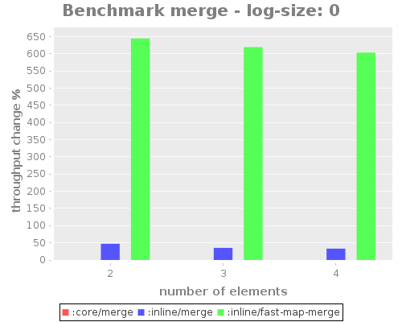
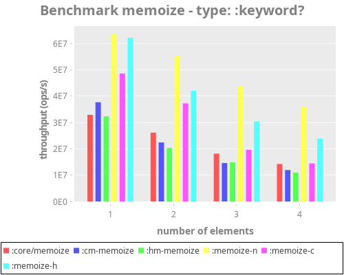
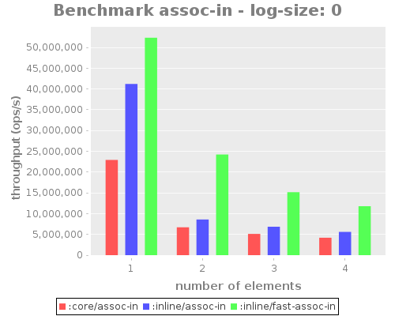
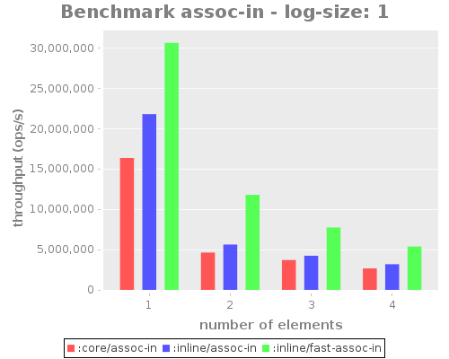

Benchmarks Results
========

<!-- markdown-toc start - Don't edit this section. Run M-x markdown-toc-refresh-toc -->
**Table of Contents**

- [Benchmarks Results](#benchmarks-results)
- [Methodology](#methodology)
    - [Benchmarks framework](#benchmarks-framework)
    - [Test structure](#test-structure)
    - [Running tests](#running-tests)
    - [Generating results](#generating-results)
- [Results](#results)
    - [assoc](#assoc)
        - [Details](#details)
        - [Results](#results-1)
        - [By count](#by-count)
            - [Throughput](#throughput)
            - [Relative speedup](#relative-speedup)
        - [By size](#by-size)
            - [Throughput](#throughput-1)
            - [Relative speedup](#relative-speedup-1)
    - [merge](#merge)
        - [Details](#details-1)
            - [Fast map merge](#fast-map-merge)
            - [Inline Merge](#inline-merge)
        - [Results](#results-2)
            - [Fast Map merge](#fast-map-merge)
            - [Inline merge & fast merge](#inline-merge--fast-merge)
        - [By size](#by-size-1)
            - [Throughput](#throughput-2)
            - [Relative speedup](#relative-speedup-2)
        - [By count](#by-count-1)
            - [Throughput](#throughput-3)
            - [Relative speedup](#relative-speedup-3)
    - [get-in](#get-in)
        - [Test details](#test-details)
        - [Results](#results-3)
        - [By count](#by-count-2)
            - [Throughput](#throughput-4)
            - [Relative speedup](#relative-speedup-4)
        - [By size](#by-size-2)
            - [Throughput](#throughput-5)
            - [Relative speedup](#relative-speedup-5)
    - [memoize](#memoize)
        - [Test details](#test-details-1)
        - [Results](#results-4)
        - [By number of arguments](#by-number-of-arguments)
        - [By type of arguments](#by-type-of-arguments)
    - [assoc-in](#assoc-in)
        - [Test details](#test-details-2)
        - [Results](#results-5)
        - [By count](#by-count-3)
            - [Throughput](#throughput-6)
            - [Relative speedup](#relative-speedup-6)
        - [By size](#by-size-3)
            - [Throughput](#throughput-7)
            - [Relative speedup](#relative-speedup-7)
    - [update-in](#update-in)
        - [By count](#by-count-4)
            - [Throughput](#throughput-8)
            - [Relative speedup](#relative-speedup-8)
        - [By size](#by-size-4)
            - [Throughput](#throughput-9)
            - [Relative speedup](#relative-speedup-9)
    - [select-keys](#select-keys)
        - [Test details](#test-details-3)
        - [Results](#results-6)
        - [By count](#by-count-5)
            - [Throughput](#throughput-10)
            - [Relative speedup](#relative-speedup-10)
        - [By size](#by-size-5)
            - [Throughput](#throughput-11)
            - [Relative speedup](#relative-speedup-11)

<!-- markdown-toc end -->

# Methodology

## Benchmarks framework

[JMH](https://github.com/jgpc42/lein-jmh) was used to run detailed benchmarks.

## Test structure

Tests are grouped by the core function they try to optimize

Since jmh is relatively static, test cases have to be generated in
advance. This is complicated in cases where we would want to test a
variable arity function without paying the overhead of `apply` and
`restFn`.

To work around this issue, the test cases are emitted as states, closing
over the macro expansion, and return a function which takes the common
input across tests.

The function and input are both passed to `clj-fast.bench/invoke` which
applies the function to any extra possible arguments, or just calls it.

## Running tests

```bash
lein jmh
```

To run a specific test:
```bash
lein jmh \
'{:pprint true 
  :progress true 
  :output "memoize.edn" 
  :select :memo 
  :params {:type [:keyword? :int? :map?]}}'
```

## Generating results

Start a REPL under `extra/clj-fast.analysis`

Load `analysis.clj` and:

```clojure
(ns clj-fast.analysis)

(def raw-data
  (->
   (into {} (map load-run) [:get-in :assoc-in :merge :assoc :update-in :select-keys])
   (update :merge #(filterv (complement (comp #{1} :count)) %))))

(def cs (bar-charts raw-data :log-size :count))
(logify :merge cs)
(write-charts cs)
```

To generate results for a different metric:

```clojure
(def rcs (bar-charts raw-data :log-size :count :relative-score))
(write-charts rcs {:prefix "relative-"})
```

# Results

Graphs show throughput per test case. Higher is better.

Dimensions:
- throughput, ops/s
- relative throughput: % change of core implementations. Naturally, it is always 0 for the base case.
- count, number of elements, for example, in `get-in` it is the length of the keys sequence.
- log-map-size: log10 of tested map's size.

## assoc

### Details

Assoc and fast assoc performance are tested with maps and records.

### Results

- `fast-assoc` ~ 15% faster than `assoc`. (Metosin)
- unrolling the rest arguments of assoc offers a significant speed up,
  ~2x for small maps, +50% for large maps.

### By count

#### Throughput

|  |  |
| :---:                              | :---:                              |
|  |  |

#### Relative speedup

|  |  |
| :---:                              | :---:                              |
|  |  |

### By size

#### Throughput

|  |  |
| :---:                              | :---:                              |
|  |  |

#### Relative speedup

|  |  |
| :---:                              | :---:                              |
|  |  |

## merge

### Details

#### Fast map merge

`fast-map-merge` is aggressively inlined and dispatches directly to `fast-assoc` and `kvreduce`

#### Inline Merge

- `inline-merge`: uses `conj` directly on all input maps instead of reducing.
- `inline-fast-map-merge`: inline merges maps using `fast-map-merge`.

### Results

#### Fast Map merge

For the case of merging two maps, it is faster by 25% up to 50% for smaller maps.

#### Inline merge & fast merge

Unrolling merge iteration over maps has diminishing returns as maps get
bigger. For small maps a non optimized merge2 unrolled version works
sees measurable yet small speedups. The version based on
`fast-map-merge` remains consistently and significant faster, although
gains to decrease with an increase in map size.


The speedup by fast-map-merge is about 25-50%, width diminishing returns the bigger maps get.

Throughput time is presented in logarithmic scale due to the huge differences for different map sizes.

### By size

#### Throughput

|  |  |
| :---:                              | :---:                              |
|  |  |

#### Relative speedup

|  |  |
| :---:                              | :---:                              |
|  |  |

### By count

#### Throughput

|                                    |  |
| :---:                              | :---:                              |
|  |  |

#### Relative speedup

|                                    |  |
| :---:                              | :---:                              |
|  |  |

## get-in

### Test details

`get-in` was tested against an inlined implementation and `get-some-in`.

### Results

Inline implementation faster by a factor of 4 for small maps and 2 for large maps.

### By count

#### Throughput

|  |  |
| :---:                               | :---:                               |
|  |  |

#### Relative speedup

|  |  |
| :---:                               | :---:                               |
|  |  |

### By size

#### Throughput

|  |  |
| :---:                               | :---:                               |
|  |  |

#### Relative speedup

|  |  |
| :---:                               | :---:                               |
|  |  |

## memoize

Closely related to get-in

### Test details

regular `memoize` was benchmarked against two implementation methods,
one which packs the arguments to a sequence and one which unrolls it.
- packed: `core/memoize`, `cm-memoize`, `hm-memoize`
- unrolled: `memoize-n`, `memoize-cm`, `memoize-hm`

Each of the implementation is backed by a different object:
- `hm`: `HashMap`
- `cm`: `ConcurrentHashMap`
- otherwise a Clojure map.

### Results

Different implementation are faster depending on the type of the
memoized arguments, see graphs for details.

### By number of arguments

#### Throughput

|  |  |
| :---:                               | :---:                               |
|  |  |

#### Relative speedup

|  |  |
| :---:                               | :---:                               |
|  |  |

### By type of arguments

#### Throughput

|     |  |
| :---:                                      | :---:                                       |
|     | |

#### Relative speedup

|     |  |
| :---:                                      | :---:                                       |
|     | |

## assoc-in

### Test details

Assoc-in is tested vs. an inlined implementation with vanilla maps, gets and 
assoc, all core functions.

### Results

- The inlined implementation is always faster
- The speedup by inlining peaks at 2 elements
- Speedup gains decrease as maps get bigger

### By count

#### Throughput

|  |  |
| :---:                                 | :---:                                 |
|  |  |

#### Relative speedup

|  |  |
| :---:                                 | :---:                                 |
|  |  |

### By size

#### Throughput

|  | 
| :---:                              | :---:                              |
|  | 

#### Relative speedup

|  | 
| :---:                              | :---:                              |
|  | 

## update-in

### Results

- The inlined implementation is always faster
- Speedup gains decrease as maps get bigger
- inlined `fast-update-in` offers dramatic improvements over inlined `update-in`

### By count

#### Throughput

|  | 
| :---:                              | :---:                              |
|  | 

#### Relative speedup

|  | 
| :---:                              | :---:                              |
|  | 

### By size

#### Throughput

|  | 
| :---:                              | :---:                              |
|  | 

#### Relative speedup

|  | 
| :---:                              | :---:                              |
|  | 

## select-keys

### Test details

`select-keys` was tested against two inlined implementations:
- correct and slower implementation.
- quicker and dirty implementation.

### Results

Inline implementation faster by a factor of 10 or more, depends
on the number of selected keys.

### By count

#### Throughput

|  | 
| :---:                              | :---:                              |
|  | 

#### Relative speedup

|  | 
| :---:                              | :---:                              |
|  | 

### By size

#### Throughput

|  | 
| :---:                              | :---:                              |
|  | 

#### Relative speedup

|  | 
| :---:                              | :---:                              |
|  | 
